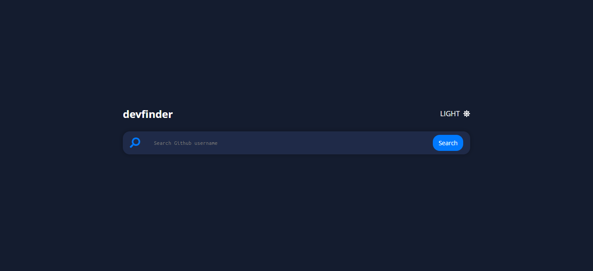
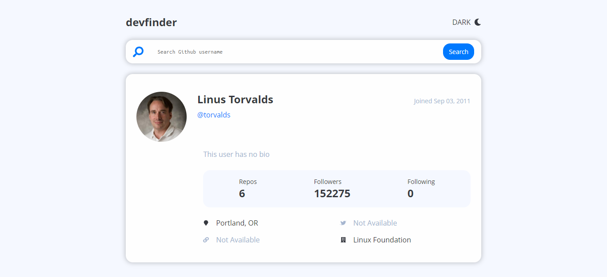
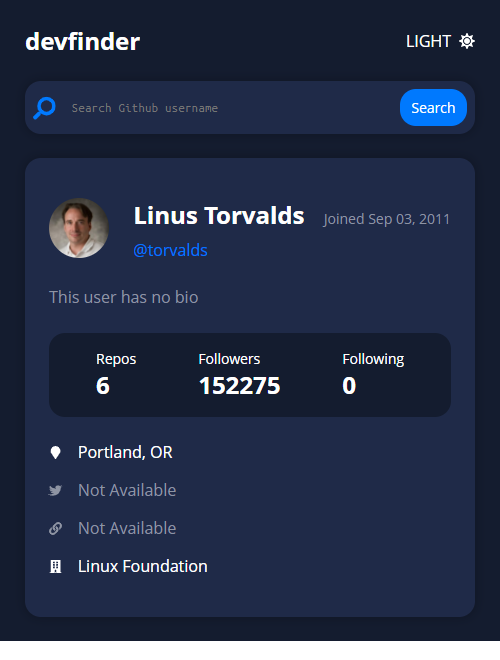

# devfinder 

## About the project

- Find Github profiles in one place.
- Project built with Next.js
- Live site: [http://devfinder-dun.vercel.app/](http://devfinder-dun.vercel.app/)

This project is based on pro challange from __frontendmentor.io__. I didn´t have access to it, so I built it by myself based on the project´s idea. 

## Screenshots

## What I learned

- React useRef hook
- JS fetch
- JS Date global object

## Author 🧑‍💻

- Frontend Mentor - [@HenriquePinheiro12](https://www.frontendmentor.io/profile/HenriquePinheiro12)
- Github - [@HenriquePinheiroo12](https://github.com/henriquepinheiro12/)
- Linkedin - [@Henrique Pinheiro](https://www.linkedin.com/in/henrique-pinheiro-a43b62203/)